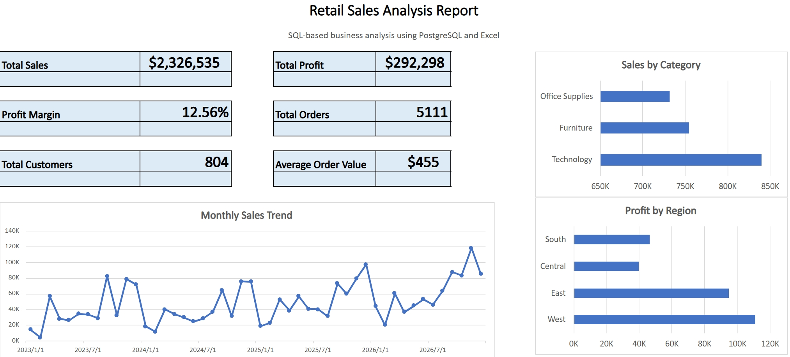

# Retail Sales Analysis – SQL & Excel


## Overview

This project presents a SQL-based retail sales analysis using the Sample Superstore dataset. The objective is to analyse sales performance, profitability, customer behaviour, product performance, regional performance, and time-based trends.

The analysis was conducted using PostgreSQL for data extraction and SQL analysis, followed by Microsoft Excel for reporting, KPI summary, and visual presentation.

---

## Business Problem

Retail management needs a clear understanding of business performance to answer questions such as:

* How much revenue and profit were generated?
* Which product categories and products performed best?
* Which customer segments contributed the most sales?
* Which regions and states generated the highest or lowest profit?
* How did sales and profit change over time?
* Which products, customers, or regions require management attention?

This project uses SQL and Excel to answer these business questions and provide actionable insights.

---

## Excel Report Preview



---

## Report

[View Executive Summary](report/Executive_Summary_SQL_Excel.pdf)

---

## Tools Used

* PostgreSQL
* pgAdmin 4
* Microsoft Excel
* GitHub

---

## SQL Analysis Modules

The SQL analysis is organised into separate business modules:

| File                        | Description                                                                 |
| --------------------------- | --------------------------------------------------------------------------- |
| `01_sales_performance.sql`  | Overall sales, profit, profit margin, category and segment performance      |
| `02_product_analysis.sql`   | Product performance, top products, loss-making products and discount impact |
| `03_customer_analysis.sql`  | Customer count, top customers, customer value and customer segmentation     |
| `04_regional_analysis.sql`  | Regional, state and city-level sales and profitability analysis             |
| `05_time_analysis.sql`      | Monthly, quarterly and yearly trend analysis                                |
| `06_advanced_analysis.sql`  | Ranking, window functions, contribution analysis and rolling averages       |
| `07_business_questions.sql` | Management-level business questions and recommendations                     |
| `08_excel_export_views.sql` | SQL views created for Excel reporting and export                            |

---

## Key Insights

* Total Sales reached **$2.33M**.
* Total Profit reached **$292K**, with a **12.56%** profit margin.
* Technology generated the highest sales among all product categories.
* Consumer customers contributed the largest share of revenue.
* The West and East regions generated the strongest profit performance.
* Several products and geographic areas showed negative profitability and require further review.
* Monthly sales showed growth over time, with visible seasonality and performance variation.

---

## Business Recommendations

* Continue prioritising high-performing product categories such as Technology.
* Review loss-making products and low-margin sub-categories to improve profitability.
* Investigate states and cities with negative profit to identify pricing, discount or operational issues.
* Use customer segmentation to target high-value and frequent customers for retention.
* Monitor monthly sales trends to support forecasting, inventory planning and campaign timing.

---

## Project Structure

```text
Retail-Sales-Analysis-SQL-Excel
│
├── data
│   └── sample_-_superstore.xls
│
├── sql
│   ├── 01_sales_performance.sql
│   ├── 02_product_analysis.sql
│   ├── 03_customer_analysis.sql
│   ├── 04_regional_analysis.sql
│   ├── 05_time_analysis.sql
│   ├── 06_advanced_analysis.sql
│   ├── 07_business_questions.sql
│   └── 08_excel_export_views.sql
│
├── excel
│   └── Retail_Sales_Analysis.xlsx
│
├── images
│   └── Excel_Report.png
│
├── report
│   └── Executive_Summary_SQL_Excel.pdf
│
├── README.md
└── LICENSE
```

---

## Skills Demonstrated

* SQL querying
* PostgreSQL database analysis
* Data aggregation
* Business KPI calculation
* Customer segmentation
* Product profitability analysis
* Regional performance analysis
* Time-series analysis
* Window functions
* Excel reporting
* Business insight generation
* Management recommendation writing

---

## Dataset

Sample Superstore dataset.
